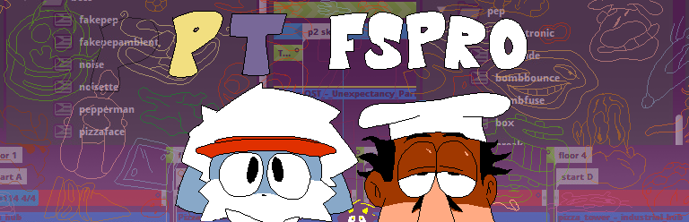

# Pizza Tower FMOD Studio Project Recreation Example Mod
Based of [Ralty's Pizza Tower FMOD Studio Project Recreation](https://github.com/Raltyro/Pizza-Tower-fspro-Recreation)  
This is a Exmaple Sound Mod | Link

## Credits
* [Raltyro](https://github.com/Raltyro) ([Gamebanana](https://gamebanana.com/members/1777465), [Twitter](https://twitter.com/Raltyro)) - Maintainer
* [AwfulNasty](https://github.com/AwfulNasty) ([Gamebanana](https://https://gamebanana.com/members/2539314)) - MAJOR Contributions on adding bunch of sfx events, linking this fspro with PT original banks, and etc
* [theCarso](https://github.com/theCarso) - Contributions on helping to make linking this fspro with PT original banks possible (Making an automated script on applying the GUIDs)
* [SlawekNowy](https://github.com/SlawekNowy) - Contributions on helping to make linking this fspro with PT original banks possible (Exporting the GUIDs)
* [MeliaDev](https://github.com/MeliaDev) ([Gamebanana](https://gamebanana.com/members/2657982), [Twitter](https://twitter.com/darkdagirl)) - Contributions help on adding events
* [thecubitosishere](https://github.com/thecubitoishere)  ([Gamebanana](https://gamebanana.com/members/2513917), [Twitter](https://twitter.com/TheCubitoIsHere))- Contributions help on adding events

Without these Contributors, this project wouldn't be possible without them!
Thank you everyone for those who contributes this project!